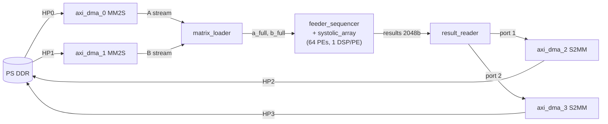
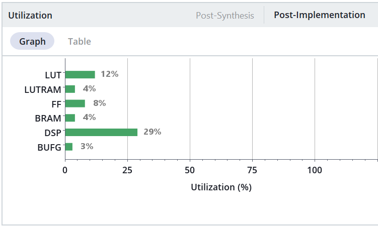
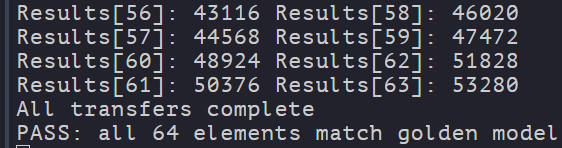

# FPGA TPU

An 8×8 systolic array matrix multiplier in SystemVerilog, running end-to-end
on a Zynq-7000 SoC. Custom RTL, custom AXI-Stream IP, dual-DMA result
readback, verified against a CPU-side golden model on real hardware.

Companion piece to [CUDA SGEMM Optimization](https://github.com/shaswat-singh23/cuda-matmul):
matrix multiplication at the hardware architecture level, implementing the
compute pipeline directly in RTL rather than scheduling threads on fixed
GPU hardware.

## Architecture



- **PEs**: 64 output-stationary MAC units, one DSP48E1 per PE (8-bit × 8-bit → 32-bit accumulate).
- **Dataflow**: skewed diagonal wavefront via per-diagonal `enable` gating. 3N-2 = 22 cycles per matmul.
- **I/O**: 4× AXI DMA in Simple mode over Zynq HP ports — 2 for input matrices, 2 for interleaved 32-elements/cycle result readback.
- **Software**: bare-metal C on ARM Cortex-A9, cache-coherent DMA setup, golden-model verification.

See `docs/` for module-level design notes.

## Status

**Working on hardware.** All 64 elements of an 8×8 matmul match the CPU golden model bit-exactly. Board: PYNQ-Z2 (XC7Z020-1CLG400C).

Resource utilization:

64 DSP48E1 slices (one per PE, 29% of Zynq-7020's 220), ~5700 LUTs, ~7300 FFs. Clock: 100 MHz (FCLK_CLK0).

## Repository Layout

```
bd/         Block design regeneration script (design_1.tcl)
docs/       Per-module design notes
rtl/        SystemVerilog source
sim/        Testbenches
vitis/      Bare-metal ARM application
```

## Build

Requires Vivado 2024.2+ and Vitis Unified IDE. From a fresh clone:

1. Create a new Vivado RTL project targeting `xc7z020clg400-1`.
2. Add all files in `rtl/` as design sources.
3. Package each of `matrix_loader`, `feeder_sequencer`, `pipeline_ctrl`, `result_reader` as a Vivado IP. Set the IP output directory as your IP repository.
4. In the Tcl console: `source ./bd/design_1.tcl`. This regenerates the block design.
5. Validate design, generate output products, run synthesis + implementation + bitstream.
6. Export XSA (`File → Export → Export Hardware`, Select "include bitstream/binary", check bitstream, leave binary unchecked).
7. In Vitis: create a new platform component from the XSA, then a new application component. Import `vitis/dma_driver.c` as a source file.
8. Program the bitstream, run the application. Expected output ends with `PASS: all 64 elements match golden model`.

## Verification

- **Simulation**: `sim/top_wrapper_tb.sv` — full-pipeline testbench with independent randomized backpressure on both S2MM ports, timeout on deadlock, cycle-count and TLAST checks, verified via waveform inspection.
- **Hardware**: automated CPU-side golden matmul in `vitis/dma_driver.c`, run at end-of-transfer against DMA'd result buffers.



## Known Limitations

- N=8 only. N=16 would require 256 DSPs, exceeding the 220 available on Zynq-7020.
- 8-bit unsigned operands with a 32-bit accumulator. Max accumulator value at N=8 is 8 × 255² ≈ 5.2 × 10⁵, well within 2³²; larger K or signed operands would require re-checking the bound.
- SG_LENGTH_WIDTH set to 8 bits on all DMAs; sufficient for N=8 but would need widening for larger single-shot transfers.

## Roadmap

- ARM-side tiling driver: run larger matmuls (64×64, 128×128) by tiling into 8×8 blocks and streaming through the array.
- HP-port memory bandwidth measurement and roofline analysis.
- Timing closure pushed above 100 MHz.
- FPGA vs. CPU throughput comparison on the same Cortex-A9.