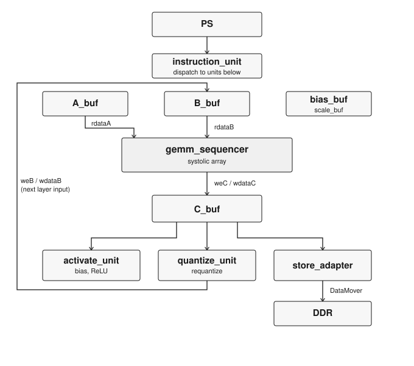
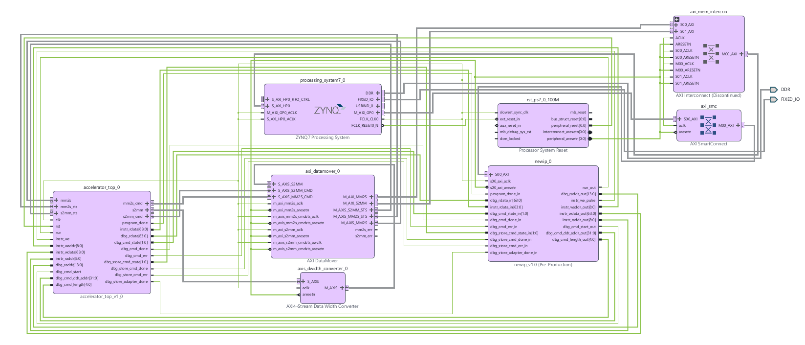

# FPGA TPU

An instruction-driven matrix accelerator in SystemVerilog, targeting a
Zynq-7000 SoC. Custom on-chip GEMM engine with its own CISC ISA, PL-side
DDR access via Xilinx DataMover, and overlapped systolic wavefronts,
architecturally modeled on Google's TPU v1 (Jouppi et al., ISCA 2017).

Companion piece to [CUDA SGEMM Optimization](https://github.com/shaswat-singh23/cuda-matmul).

## Status

Fully validated end to end on real PYNQ-Z2 silicon, hardware through
a complete batched MNIST inference demo.

The `gemm_sequencer` rewrite (instruction-driven, on-chip GEMM engine
with overlapped wavefronts and a PL-side AXI4 master via DataMover)
replaced the original fixed-function design and is bit-exact on
hardware. That includes a full three-layer inference pipeline
(MATMUL, ACTIVATE with bias, QUANTIZE, and manually-tiled accumulate
for contraction dimensions wider than one MATMUL call covers),
running a real 3-layer MLP trained from scratch, quantized to int8,
and deployed entirely on-chip.

Result: on a 64-image test batch, the accelerator's output matches a
Python golden model bit-for-bit, in 1,646 &micro;s versus 296,187
&micro;s for an equivalent software loop on the same ARM core. Same
weights, same batch, same quantized arithmetic, only the
accelerator-vs-not variable changes. About 180x speedup. Model
accuracy on held-out data is around 91 percent, this particular batch
draw happened to land lower, but the result being demonstrated here
is that hardware and software agree exactly.

See `docs/accelerator_plan.md` for the full ISA spec, instruction
encoding, memory map, and design rationale, including a documented
known issue and workaround around C_buf addressing (see below).

## Architecture



Full block diagram of PS and PL; accelerator_top encapsulates PL

- ISA: 9-instruction CISC set (LOAD_A, LOAD_B, LOAD_BIAS, LOAD_SCALE,
  MATMUL, STORE_C, ACTIVATE, QUANTIZE, HALT), 64-bit fixed-width
  instructions, 7 opcodes reserved for future use. MATMUL is a single
  instruction whose EXECUTE stage runs the full i,j,k tile sweep, with
  an accumulate flag for instruction-stream-managed contraction tiling.
- PEs: 64 output-stationary MAC units, dual accumulator banks per PE,
  one DSP48E1 per PE (8-bit signed times 8-bit signed to 32-bit
  signed accumulate).
- Overlapped wavefronts: enable, pingpong, and pingpongrst are per-diagonal ([2N-2:0] wide, [i+j] addressed) rather than globally broadcast, so different diagonals can be mid-accumulation on different output tiles simultaneously. A naive systolic array wastes most of its cycles on fill and drain (about 36% average PE utilization at this array size). Overlapping tiles this way gets steady-state utilization close to 100 percent for any real chain of tiles, which is most of what this accelerator actually runs.
- On-chip memory: A_buf/B_buf/C_buf/bias_buf/scale_buf sized for the
  MNIST demo workload (a 784→64→64→10 MLP at batch=64, with the final
  layer's output padded to a full 64-wide tile to match the batch
  dimension). See the memory map in `docs/accelerator_plan.md` for
  exact depths.
- PS-PL interface: PL-initiated DDR access via Xilinx DataMover (no
  hand-written AXI4 master, no PS-driven DMA) and one AXI-Lite slave
  (`newip`) for the PS to write the instruction program and read back
  debug state.
- ACTIVATE (ReLU plus optional per-neuron bias) and QUANTIZE
  (per-neuron scale/shift/clamp, feeding a quantized layer's output
  directly back in as the next layer's input) are both implemented
  and hardware-verified.

See `docs/accelerator_plan.md` for the full ISA spec, instruction
encoding, memory map, and design rationale.

## Known Issue

There is an unresolved hardware bug in C_buf addressing, most likely
a same-address dual-port BRAM collision inside `tile_bram.sv`. It has
a verified, documented workaround (a fixed C_buf base address instead
of 0) rather than a root-cause fix. See "Known Issue" in
`docs/accelerator_plan.md` for the exact rule and what's already been
ruled out. Root cause is deferred, not abandoned.

## Repository Layout

```
bd/         Block design regeneration script (design_1.tcl)
docs/       Design notes and architecture plan
images/     Diagrams referenced from this README
rtl/        SystemVerilog source
sim/        Testbenches
mnist/      From-scratch training, quantization export, and golden model
vitis/      Bare-metal ARM application (accelerator driver + software baseline)
```

## Verification

Hardware (PYNQ-Z2):
- Full three-layer MNIST inference pipeline: matches the Python
  golden model bit-for-bit on the demo batch (see Status above for
  accuracy context).
- About 180x speedup over an equivalent plain-C software loop on the
  same ARM core, same quantized int8 arithmetic, same input batch.
- Accumulate/K-tiling, including the full accumulate to ACTIVATE to
  QUANTIZE handoff: 0 mismatches.
- Instruction memory addressing beyond the original slot count, high
  BRAM address access: verified.

Software (numpy, from scratch):
- MLP trained from scratch, no framework, on MNIST, 784→64→64→10,
  full-batch gradient descent with L2 bias regularization to keep
  quantized bias magnitudes within int8 range at zero accuracy cost.
- Bespoke quantization exporter: per-neuron weight scales, solved
  per-layer (M, shift) requantization parameters via a brute-force
  shift sweep.
- Golden model reproducing hardware's exact int8/int32 fixed-point
  arithmetic in numpy. This is what the hardware result above is
  checked against.

Simulation:
- `gemm_sequencer`: randomized signed TB sweeping every supported N
  (16-128, step 8) pre-accumulate, plus a dedicated accumulate TB.
  All cases pass. `sim/gemm_sequencer_tb.sv`.
- `tile_bram`: isolated TB, write/read correctness, registered read
  latency, independent-port behavior. Does not currently reproduce
  the hardware collision issue noted above (idealized behavioral RAM
  model vs. the real synthesized primitive).
- `quantize_unit`: 5-trial back-to-back TB, no reset between runs,
  including length=1 and scale=0 edge cases.

Not yet built: randomized backpressure testing on the DataMover
interface, a simulation model that reproduces the C_buf collision
issue.

## History

The instruction-driven `gemm_sequencer` redesign described above has
been merged into `main` and is the current design. It replaced an
earlier fixed-function 8x8 design: four PS-side AXI DMAs, verified
bit-exact on hardware, with a software tiling driver reaching about
16.9 MB/s at 64x64 after two rounds of measured optimization
(tile-major memory layout, tile-local accumulation, see
`docs/perf_optimization.md`).

- 64 DSP48E1 slices (one per PE, 29% of Zynq-7020's 220), about 5700
  LUTs, about 7300 FFs, 100 MHz.
- N=8 fixed array size, 8-bit unsigned operands.

## Build

Requires Vivado 2024.2+ and Vitis Unified IDE. The current design on
`main` is fully hardware-validated (first hardware-verified milestone
tagged `v2.0-option-c-hardware-working`). Formal build documentation
is still pending.