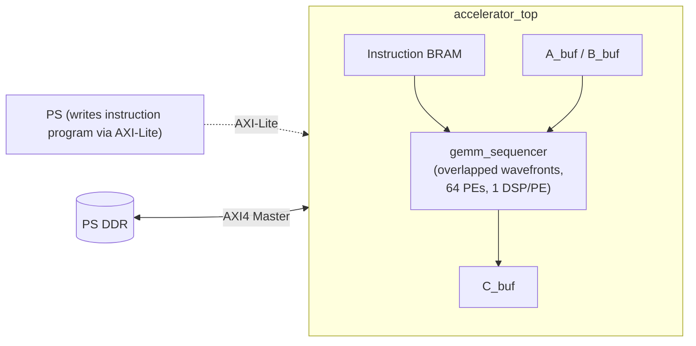

# FPGA TPU

An instruction-driven matrix accelerator in SystemVerilog, targeting a
Zynq-7000 SoC. Custom on-chip GEMM engine with its own CISC ISA, PL-side
AXI4 master, and overlapped systolic wavefronts, architecturally modeled
on Google's TPU v1 (Jouppi et al., ISCA 2017).

Companion piece to [CUDA SGEMM Optimization](https://github.com/shaswat-singh23/cuda-matmul).

## Status

Major rewrite in progress on the `gemm_sequencer` branch. The original
design on `main` was a fixed-function 8x8 systolic array driven by four
PS-orchestrated DMAs. A software tiling driver reached ~16.9 MB/s
effective throughput at 64x64, but profiling showed the pipeline was
latency-bound on per-tile PS-PL round trips (~15us/tile setup vs
~500ns/tile of actual compute), not on hardware throughput.

The rewrite moves the matmul sweep into the PL: a custom instruction
set, an on-chip GEMM engine with overlapped wavefronts, and a PL-side
AXI4 master that pulls/pushes DDR directly.

`gemm_sequencer`, the core compute engine, is verified in simulation:
randomized signed matmul correct across every supported N (16 to 128),
checked element-by-element against a CPU golden model. AXI4 master,
instruction fetch/decode, and the ACTIVATE/QUANTIZE instructions remain
before this runs on hardware. See `docs/accelerator_plan.md`.

## Architecture



- ISA: 7-instruction CISC set (LOAD_A, LOAD_B, MATMUL, STORE_C,
  ACTIVATE, QUANTIZE, HALT), 64-bit fixed-width instructions. MATMUL is
  a single instruction whose EXECUTE stage runs the full i,j,k tile
  sweep.
- PEs: 64 output-stationary MAC units, dual accumulator banks per PE,
  one DSP48E1 per PE (8-bit signed x 8-bit signed to 32-bit signed
  accumulate).
- Overlapped wavefronts: enable, pingpong, and pingpongrst are
  per-diagonal (`[2N-2:0]` wide, `[i+j]` addressed) rather than
  globally broadcast, so different diagonals can be mid-accumulation
  on different output tiles simultaneously.
- On-chip memory: A_buf/B_buf/C_buf sized for MAX_N=128, 7-sample
  batching on A/C, 1 stationary sample on B.
- PS-PL interface: one AXI4 master (PL-initiated DDR reads/writes) and
  one AXI-Lite slave (PS writes the instruction program). No PS-driven
  DMA.

See `docs/accelerator_plan.md` for the full ISA spec, instruction
encoding, memory map, and design rationale.

## Repository Layout

```
bd/         Block design regeneration script (design_1.tcl)
docs/       Design notes and architecture plan
rtl/        SystemVerilog source
sim/        Testbenches
vitis/      Bare-metal ARM application
```

## Verification

- gemm_sequencer: randomized signed TB sweeping every supported N
  (16-128, step 8), checked element-by-element against a CPU golden
  model. All cases pass. `sim/gemm_sequencer_tb.sv`.
- tile_bram: isolated TB verifying write/read correctness, 1-cycle
  registered read latency, independent-port behavior, same-address
  collision behavior.
- Full-pipeline TB not yet written, pending AXI4 master and
  instruction decode.

## Prior version

`main` holds the original fixed-function 8x8 design: four PS-side AXI
DMAs, verified bit-exact on hardware, with a software tiling driver
reaching ~16.9 MB/s at 64x64 after two rounds of measured optimization
(tile-major memory layout, tile-local accumulation, see
`docs/perf_optimization.md`).

- 64 DSP48E1 slices (one per PE, 29% of Zynq-7020's 220), ~5700 LUTs,
  ~7300 FFs, 100 MHz.
- N=8 fixed array size, 8-bit unsigned operands.

## Build

Requires Vivado 2024.2+ and Vitis Unified IDE. Build instructions for
the new design will be added once the AXI4 master and block design are
complete. For the prior N=8 version, see `main`.